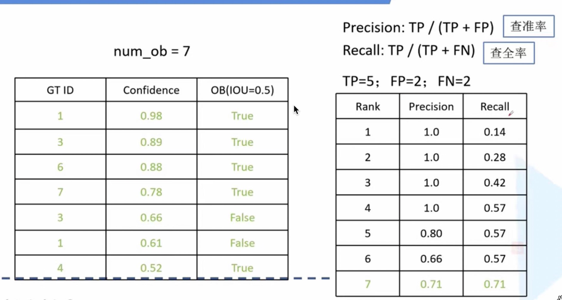
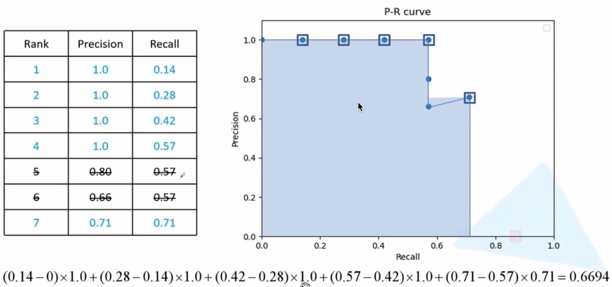

目标检测中的常见指标：

TP（True Positive）: IOU > 0.5的检测框的数量（同一Ground Truth只计算一次）
FP（False Positive）：IOU ≤ 0.5的检测框数量（或者是检测到同一个GT的多余检测框的数量）
FN（False Negative）：没有检测到的GT的数量(漏检)

Precision：TP/(TP+FP)，模型预测的所有目标中，预测正确的比例---查准率
Recall：TP/(TP+FN)，所有真实目标中，模型预测正确的目标比例---查全率

AP：P-R曲线下面积
P-R曲线：Precision-Recall曲线

mAP：mean Average Precision，即各类别AP的平均值

