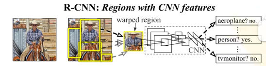
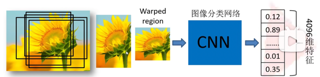
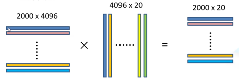
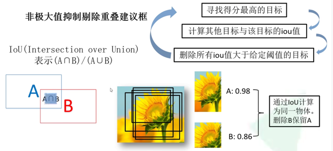
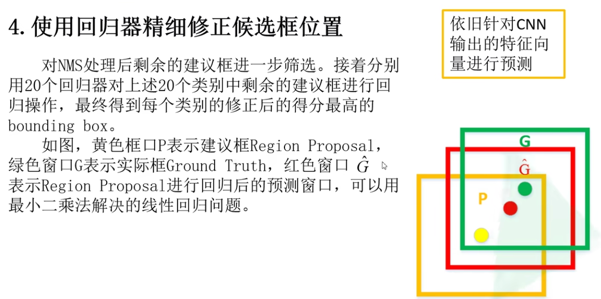
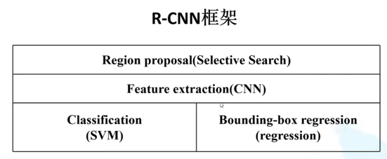
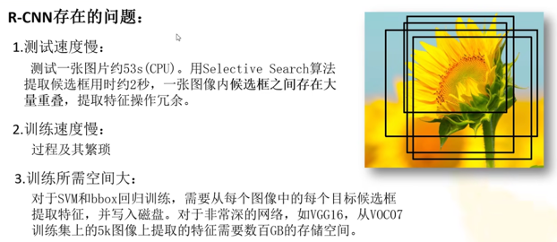

Faster RCNN理论合集

一、RCNN
《Rich feature hierarchies for accurate object detection and semantic segmentation》2014年提出
R-CNN可以说是利用深度学习进行目标检测的开山之作。作者Ross Girshick多次在PASCAL VOC的目标检测竞赛中折桂，曾在2010年带领团队获得终身成就奖。
R-CNN（Region with CNN features）
R-CNN算法流程可以分为4个步骤：
- 一张图像生成1k~2k个候选区域（使用selective search方法）
- 对每个候选区域，使用深度网络提取特征
- 特征送入每一类的SVM分类器，判别是否属于该类
- 使用回归精细修正候选框位置

1、候选区域的生成
利用selective search算法通过图像分割的方法得到一些原始区域，然后利用一些合并策略将这些区域合并，
得到一个层次化的区域结构，而这些结构就包含着可能需要的物体。
2、对每个候选区域，使用深度网络提取特征
将2000个候选区域缩放到227x227 pixel，接着将候选区域输入事先训练好的AlexNet CNN网络，获取4096维的特征，得到2000x4096维的矩阵

3、特征送入每一类的SVM分类器，判定类别（注：SVM分类器是一个二分类的分类器）
将2000x4096维特征与20个SVM组成的权重矩阵4096x20相乘，得到2000x2000维的矩阵，表示每个建议框上课某个目标类别的得分。
分别对上述2000x20维矩阵中的每一列即每一类进行非极大值抑制，剔除重叠建议框，得到该列即该类中得分最高的一些建议框。

4、

总体框架：

二、Fast R-CNN

三、Faster R-CNN